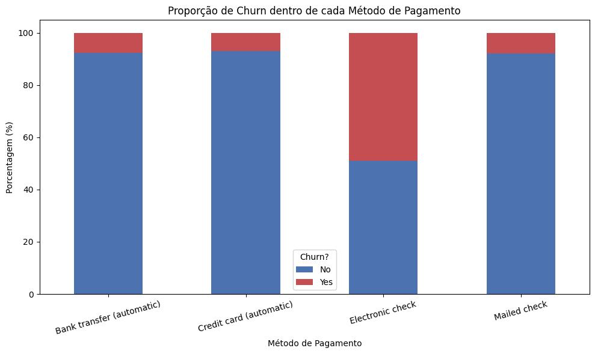
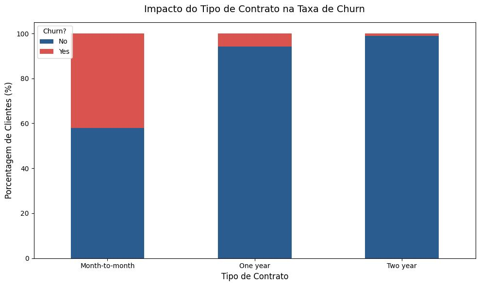
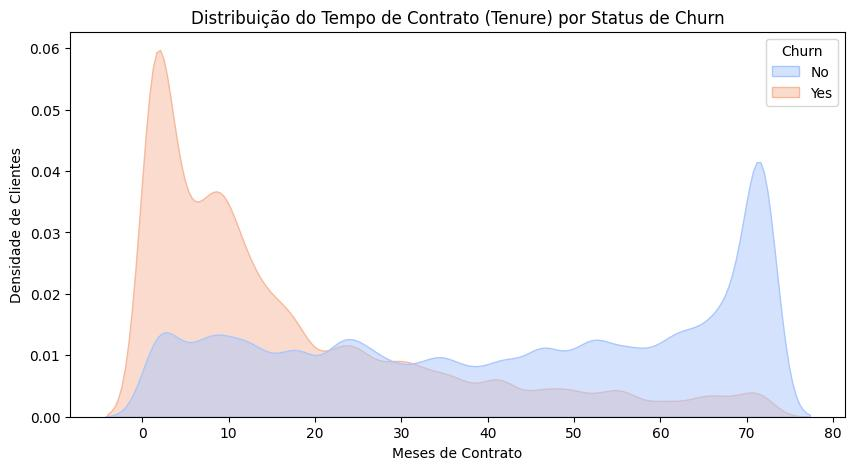
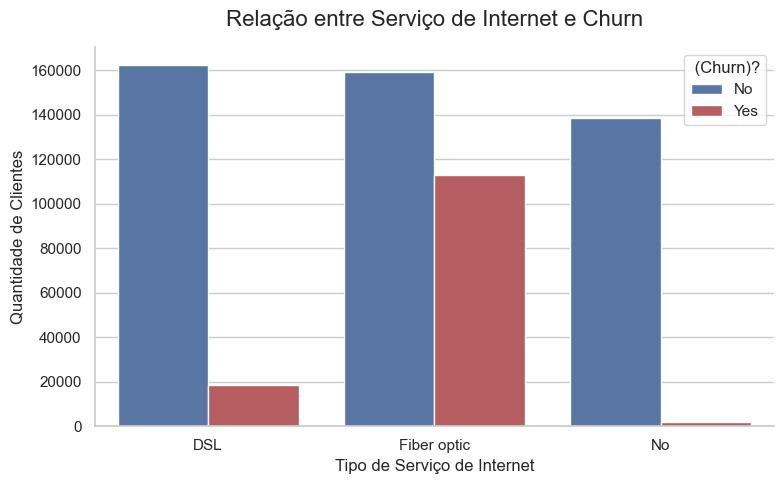
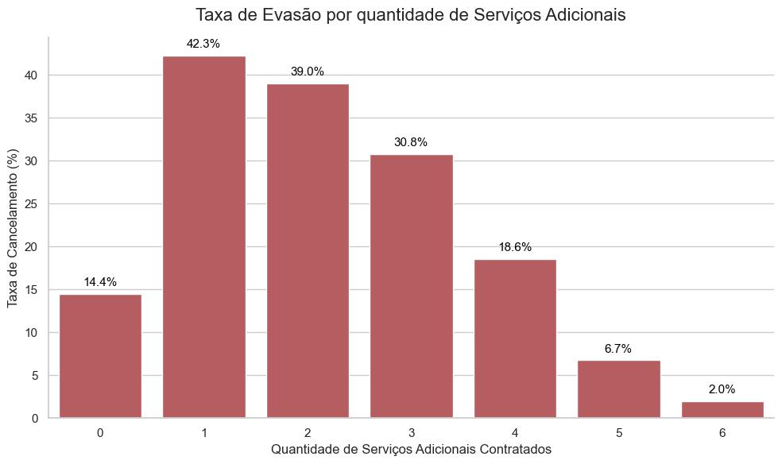
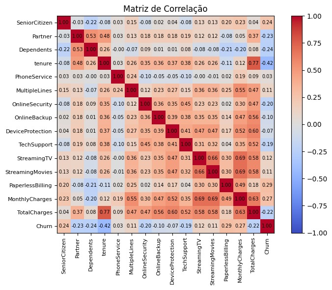
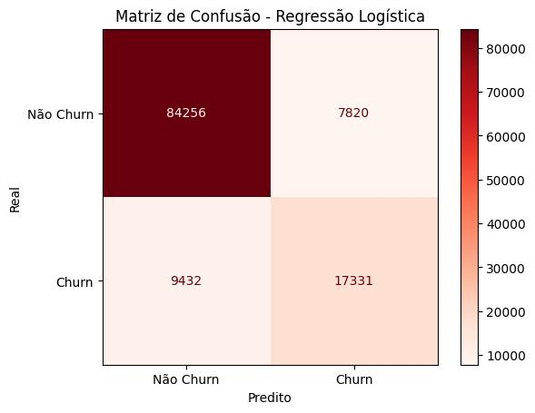
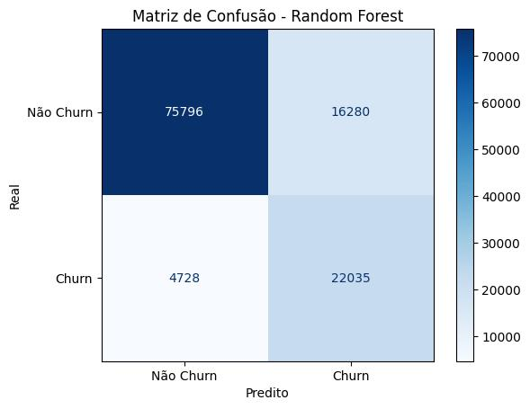
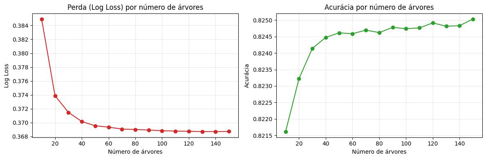

## O Desafio de Negócio {.smaller}

**O Cenário da Empresa**
A operadora de telecomunicações enfrenta um dos maiores inimigos da lucratividade moderna: a perda constante de receita através da evasão de clientes (o famoso **Churn**).

**A Missão da RET Consultoria**
Nossa equipe foi contratada para encontrar o padrão escondido nesses cancelamentos. O nosso objetivo é usar a inteligência dos dados para **identificar clientes com alto risco de saída** e ajudar a diretoria a desenvolver estratégias preditivas de retenção.

---

## O Escopo do Projeto {.smaller}

Para resolver o problema de negócio e estancar a perda de clientes, a diretoria nos exigiu respostas claras para **seis perguntas centrais**:

* Clientes com contratos mensais cancelam mais?
* Certos métodos de pagamento estão atraindo a evasão?
* O tempo de permanência influencia a lealdade?
* Há algum gargalo no serviço de Fibra Óptica?
* Serviços adicionais realmente ajudam a segurar o cliente?

--------

# Análise Descritiva e Exploratória

------------------------------------------------------------------------

## Visão Geral da Base

**O que vamos investigar?**

* Compreender os componentes que estruturam o nosso público.
* Analisar a distribuição do tempo de contrato (*Tenure*), valores pagos e perfil comportamental.

. . .

**Qualidade e Estrutura do Conjunto de Dados**

* **Volume:** 594.194 registros únicos.
* **Variáveis:** 21 colunas no total.
* **Integridade:** Base 100% preenchida (**zero valores nulos** ou dados faltantes).

------------------------------------------------------------------------

### Estrutura e Variáveis 

**Nossas 21 variáveis estão divididas em 4 pilares principais:**

* **Perfil Demográfico:** Características do cliente como gênero, faixa etária (*SeniorCitizen*), parceiros e dependentes.
* **Serviços Contratados:** Infraestrutura de telefonia e internet, além de pacotes adicionais (segurança online, backup, streaming, etc.).
* **Informações Financeiras:** Relação contratual (tempo de permanência/*tenure*, tipo de contrato, método de pagamento) e as variáveis contínuas de custo (*Monthly/Total Charges*).
* **Variável Alvo:** *Churn* (indicador principal que aponta se o cliente cancelou ou não o serviço).

------------------------------------------------------

## Perfil Numérico: Estatísticas Descritivas

Uma descrição estatística básica das variáveis numéricas do conjunto de dados é apresentada a seguir:

::: {}
+-------+---------------+---------------+-----------+----------------+--------------+
|       | id            | SeniorCitizen | tenure    | MonthlyCharges | TotalCharges |
+=======+===============+===============+===========+================+==============+
| count | 594194        | 594194        | 594194    | 594194         | 594194       |
+-------+---------------+---------------+-----------+----------------+--------------+
| mean  | 297096.5      | 0.114102      | 36.577258 | 65.866223      | 2494.377057  |
+-------+---------------+---------------+-----------+----------------+--------------+
| std   | 171529.177263 | 0.317936      | 25.061922 | 31.067444      | 2353.916710  |
+-------+---------------+---------------+-----------+----------------+--------------+
| min   | 0.0           | 0.0           | 1.0       | 18.25          | 18.8         |
+-------+---------------+---------------+-----------+----------------+--------------+
| 25%   | 148548.25     | 0.0           | 12.0      | 29.9           | 639.65       |
+-------+---------------+---------------+-----------+----------------+--------------+
| 50%   | 297096.5      | 0.0           | 35.0      | 74.1           | 1433.65      |
+-------+---------------+---------------+-----------+----------------+--------------+
| 75%   | 445644.75     | 0.0           | 62.0      | 90.8           | 4263.8       |
+-------+---------------+---------------+-----------+----------------+--------------+
| max   | 594193.0      | 1.0           | 72.0      | 118.75         | 8684.8       |
+-------+---------------+---------------+-----------+----------------+--------------+
:::

---------------------

  **Principais Insights da Distribuição:**
  
  * **Demografia:** A variável `SeniorCitizen` (binária) apresenta média de 0.11, indicando que a nossa base é predominantemente jovem/adulta, com idosos representando apenas **11,4%** dos clientes.
  
  * **Retenção (`Tenure`):** Apresenta grande dispersão (desvio padrão de 25 meses para um máximo de 72). A mediana de 35 meses e a média de 36 meses sugerem uma distribuição razoavelmente equilibrada entre clientes novos e antigos.
  
  * **Comportamento Financeiro:** * `MonthlyCharges`: Mostra variação considerável, refletindo a diversidade de pacotes (de básicos a premium).
      * `TotalCharges`: Apresenta **forte assimetria**. A média (2.494) é muito superior à mediana (1.433), indicando que a maior concentração de clientes possui custos totais mais baixos, enquanto uma minoria com alto valor acumulado eleva a média.
      
------------------------

### Análise Bivariada - Gênero vs Churn

* A base é perfeitamente **equilibrada**, com aproximadamente 50% de clientes do gênero masculino e 50% do feminino.

* **Associação Irrelevante:** O teste estatístico revelou uma associação de apenas **0,0068** entre gênero e evasão.
* **Insight de Negócio:** O gênero do cliente **não influencia** a propensão ao Churn. Estratégias de retenção devem desconsiderar distinções de gênero.

::: {#tbl-genero}

| Gênero   | quantidade | porcentagem |
|:---------|:-----------|:------------|
| Feminino |   298738   | 50.276172   |
| Masculino|   295456   | 49.723828   |

: Distribuição de clientes por gênero
:::

-----------------

### Análise Bivariada - Pagamento vs Churn 

{fig-align="center"}

O método de pagamento com maior percentual de churn nesta operação é o Cheque Eletrônico, tendo quase 50% das operações consolidadas em "Yes".

------------------

### Análise Bivariada - Contrato vs Churn

{fig-align="center"}

Graficamente temos um reforço para a conclusão, há uma associação entre o tipo de contrato e churn e, de forma mais especifica, a modalidade month-to-month é a que detem a maior quantidade de churn. Com um percentual um pouco maior que 40%.

-------------------

### Análise Bivariada - Tempo de Contrato vs Churn

{fig-align="center"}

O risco de perda de clientes é crítico no início da jornada. A empresa precisa focar urgentemente em estratégias de retenção para novos clientes nos primeiros meses. Se o cliente ultrapassar essa barreira inicial, a probabilidade de ele se tornar um cliente fiel a longo prazo é muito alta.

-------------------------

### Análise Bivariada - Tipo de internet vs Churn

{fig-align="center"}

Dentre todos os serviços ofertados pela empresa, o de fibra óptica é o que contém a maior parcela de evasão. Apresentou uma associação de 0,4259.

---------------------

### Impacto dos Serviços Adicionais no Churn

{fig-align="center"}
Quanto maior a quantidade de serviços associadas ao cliente, menor a taxa de Churn.

----------------------

## Perfil dos Clientes: O Retrato do Risco {.smaller}

A partir da análise descritiva, conseguimos mapear os dois extremos comportamentais da nossa base de clientes:

::: {.columns}

::: {.column width="50%"}
#### - Perfil Propenso ao Churn {.smaller}
* **Contrato:** Predominantemente mensal (*month-to-month*).
* **Tempo de Casa:** Menor tempo de permanência (*tenure* baixo).
* **Tecnologia:** Assinantes de **Fibra Óptica** (serviço com maior índice de evasão).
* **O "Pico de Risco":** Possuem **apenas 1 serviço adicional** contratado (taxa crítica de 42,2% de cancelamento).
* **Financeiro:** Maior incidência entre os que utilizam **cheque eletrônico**.
:::

::: {.column width="50%"}
#### - Perfil Propenso à Retenção{.smaller}
* **Contrato:** Compromissos de longo prazo (anual ou bienal).
* **Tempo de Casa:** Clientes maduros com maior tempo de permanência.
* **O "Efeito Ecossistema":** Possuem **combos de 2 a 6 serviços adicionais**, o que blinda o cliente e derruba a taxa de evasão para até 1,9%.
* **Comportamento:** Maior fidelidade e estabilidade na base.
:::

:::

---------------------

## Matriz de Correlação {.smaller}

{fig-align="center" width="65%"}

::: {style="font-size: 60%;"}
Como podemos ver no mapa, o tempo de casa (Tenure: -0.42) protege a empresa. Por outro lado, faturas mais altas e cobranças digitais (0.29 e 0.27) acendem um alerta para o risco de cancelamento.
:::

--------------------

### Modelagem Preditiva

  A fase de modelagem é onde vamos buscar algoritmos clássicos de classificação que captem e expliquem bem a variabilidade dos dados e prevejam a evasão do cliente.

Dividimos os nossos dados:

*  **Treino (80%):** O maior percentual da base original, utilizado para ensinar os padrões comportamentais ao algoritmo.
*  **Teste (20%):** A parcela restante separada exclusivamente para análise e validação da predição dos modelos em um cenário "desconhecido".

### Modelos Aplicados

*  Logistic Regression (Modelo paramétrico logístico)

*  Random Forest (Modelo baseado em árvores de decisão e ensemble)

----------------------

### Desempenho do Modelo: Regressão Logística {.smaller}

**Métricas Globais de Avaliação**

* **Acurácia Global:** **85.48%** de previsões corretas na base de teste.
* **Log Loss (0.31):** Um erro logarítmico excepcionalmente baixo. Isso indica que o modelo possui alta confiança e precisão nas probabilidades calculadas, não apenas "chutando" os resultados.

::: {.columns}

::: {.column width="55%"}

{fig-align="center" width="100%"}

:::
::: {.column width="45%"}
::: {style="font-size: 60%;"}

**Análise de Risco (Matriz de Confusão):**

* **Falsos Positivos:** Clientes leais classificados como evasão. O modelo demonstra uma leve inclinação conservadora, preferindo errar por cautela.

* **Falsos Negativos:** O volume de "cancelamentos" foi drasticamente reduzido com o tratamento adequado das variáveis. A empresa agora possui um radar antecipado altamente eficaz.

:::
:::

:::

-----------------------------------

  ### Random Forest: Impacto no Negócio {.smaller}

**Métricas e Estratégia de Retenção**

* **Acurácia Global:** **82,3%** de previsões corretas na base de teste.
  * **Recall (Sensibilidade):** **82,3%** O maior índice da nossa consultoria, mostrando máxima eficiência em "pescar" os clientes em risco de Churn.

::: {.columns}

::: {.column width="55%"}

{fig-align="center" width="100%"}
:::
::: {.column width="45%"}
::: {style="font-size: 60%;"}

**Matriz de Confusão**

* **Falsos Negativos (Apenas 4.728):** Reduzimos drasticamente o pior risco de negócio.

* **Falsos Positivos (16.280):** Clientes leais classificados como evasão. O modelo é altamente sensível, preferindo pecar pelo excesso de cautela (oferecer uma ação de retenção a quem não ia cancelar) do que perder o cliente

:::
:::

:::

-------------------

### Random Forest: Estabilidade Técnica {.smaller}

Para garantir que o resultado não foi "obra do acaso", a testamos o limite matemático do modelo simulando o crescimento da floresta até 150 árvores.

{fig-align="center" width="65%"}

* **Prevenção de Overfitting:** As linhas provam que o modelo atinge a maturidade e estabiliza seu aprendizado (Acurácia e Log Loss).

* **Eficiência:** Comprovamos que encontramos o ponto exato onde o erro matemático para de cair, entregando à empresa um modelo estatisticamente sólido, leve e pronto para ser executado todo mês.

-----------------

## Conclusão: Qual modelo escolher? {.smaller}

Ao invés de eleger um único "vencedor", nossa recomendação é usar os dois algoritmos em conjunto, pois eles resolvem problemas diferentes da empresa:

* 📊 **Regressão Logística (Foco na Estratégia):** Com **85.5% de acurácia**, ele é o nosso modelo transparente. Ele nos provou matematicamente *o que* faz o cliente ir embora (contratos mensais e fibra óptica). É a ferramenta perfeita para a diretoria repensar os produtos da empresa.

* 🌲 **Random Forest (Foco na Operação):** Com um **Recall altíssimo (82.3%)**, ele atua como nosso "cão de guarda". Ele aceita errar um pouco mais nos Falsos Positivos só para ter certeza de que quase nenhum cancelamento passe batido. É ideal para o uso diário da equipe de atendimento.

---

## Plano de Ação: Próximos Passos {.smaller}

Com base nos dados, o que a empresa pode fazer para reduzir a perda de clientes?

**1. Mudar a forma de vender a Fibra Óptica:**
Vender a internet de fibra isolada (sem outros serviços) provou ser um risco enorme. A empresa precisa criar combos com descontos agressivos para incentivar a assinatura de 3 ou mais serviços, "amarrando" o cliente.

**2. Fugir do Contrato Mensal:**
É o formato que mais gera evasão. Sugerimos subsidiar a primeira mensalidade ou dar bônus para convencer o cliente a fechar o plano Anual logo no primeiro contato.

**3. Ligar para a pessoa certa (Radar de Churn):**
Colocar o Random Forest para rodar no sistema da empresa. Em vez da equipe de retenção tentar adivinhar quem vai cancelar, eles vão oferecer descontos preventivos *apenas* para a lista vermelha gerada pelo modelo todo mês.

---

## Muito Obrigado!

**Equipe de Consultoria Estatística:**
* [Eloísa da Silva Costa]
* [Richard Matheus Avelino da Silva]
* [Túlio Herculano Silva Lima]